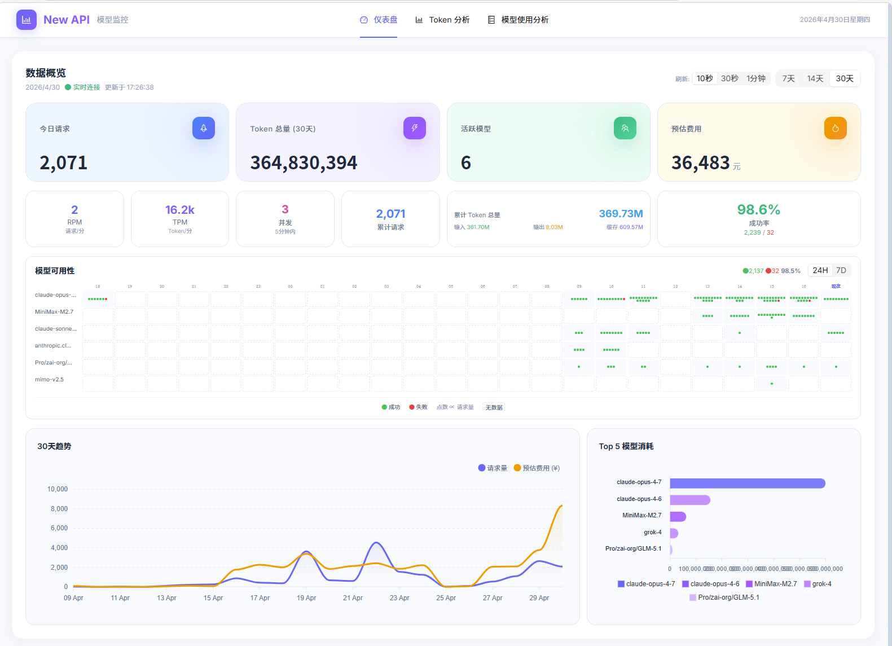

# New API Monitor



只读方式接入 [new-api](https://github.com/Calcium-Ion/new-api) 数据库的模型用量与可用性监控面板。
实时展示 Token 消耗、花费、Top 模型、**模型可用性点阵热力图**，便于观察在不同时间段各模型的请求量与成功率。

> 本项目仅 `SELECT` 读取 `logs` 表，不做任何写入，**可安全挂接生产库**。

---

## 功能特性

- **实时概览**：Token（输入 / 输出 / 缓存）、请求量、花费、成功率，WebSocket 推送
- **N 天趋势**：可选 7 / 14 / 30 天请求量与 Token 走势
- **Top 模型排行**：按 Quota 消耗排序的前 5 模型
- **模型可用性点阵**：
  - 24H / 7D 切换（7D 按 8 小时聚合为 21 格）
  - 每格以**绿点 / 红点**呈现请求量与成功 / 失败比
  - 基于 `FLOOR(created_at/3600)` UTC 整点桶，跨日与时区无错位
  - 同时统计 `type=2`（成功消费）与 `type=5`（错误请求）
- **Token 分析页**：按模型、按 Token 类型的用量细分

---

## 技术栈

| 层 | 技术 |
| --- | --- |
| 前端 | React 19 · Vite 6 · Ant Design 5 · ApexCharts · Axios · Day.js |
| 后端 | Node.js 20 · Express 5 · TypeScript · mysql2 · ioredis · ws |
| 数据 | MySQL（new-api 的 `logs` 表）· Redis（查询缓存） |
| 部署 | Docker 多阶段构建 · docker-compose |

---

## 目录结构

```
newapi-data/
├── server/                 后端（Express + TS）
│   └── src/
│       ├── routes/         REST 路由：overview / tokens / heatmap
│       ├── services/       SQL 查询服务（只读）
│       ├── cache.ts        Redis withCache 封装
│       ├── websocket.ts    实时指标推送
│       ├── db.ts           MySQL 连接池
│       └── index.ts        入口
├── web/                    前端（React + Vite）
│   └── src/
│       ├── pages/          Dashboard / Heatmap / TokenUsage
│       ├── components/     ModelHeatmap / TopModelsChart / TrendChart …
│       ├── hooks/          useWebSocket
│       └── api/            HTTP 客户端
├── Dockerfile              三段式构建（前端 → 后端 → 运行时）
├── docker-compose.yml      app + redis
├── env.config.json.example 本地开发配置样例
├── .env.example            docker-compose 环境变量样例
└── package.json            根工作区（concurrently 启动 dev）
```

---

## 快速开始

### 前置要求

- Node.js ≥ 20
- 可访问的 new-api MySQL（只需 `SELECT` 权限）
- Redis 6+

### 1. 本地开发

```bash
# 1) 安装全部依赖（root / server / web）
npm run install:all

# 2) 复制配置
cp env.config.json.example env.config.json
# 编辑 env.config.json，填入真实 SQL_DSN 与 REDIS_CONN_STRING

# 3) 启动（同时起前后端）
npm run dev
```

- 前端：<http://localhost:5173>
- 后端：<http://localhost:3002>

Windows 用户可直接双击 `install.bat` → `start.bat`。

### 2. Docker 部署（推荐生产）

```bash
cp .env.example .env
# 编辑 .env，至少填写 SQL_DSN
docker-compose up -d --build
```

默认映射到 `http://<host>:16302`。健康检查：`/api/health`。

---

## 配置说明

优先级：**环境变量 > `env.config.json`**（`server/src/config.ts`）。

| Key | 是否必填 | 说明 | 默认值 |
| --- | --- | --- | --- |
| `SQL_DSN` | ✅ | new-api MySQL DSN，格式 `user:pass@tcp(host:port)/db`，仅需 `SELECT` 权限 | — |
| `REDIS_CONN_STRING` | ✅ | Redis 连接串，用于查询结果短 TTL 缓存 | — |
| `PORT` |   | 后端 HTTP 端口（容器内） | `3002` |
| `COST_RATE` |   | Token → 美元换算系数（用于"花费"统计），按渠道平均价校正 | `0.0001` |
| `REFRESH_INTERVAL` |   | WebSocket 实时指标推送间隔（毫秒） | `30000` |

> ⚠️ **不要把真实数据库凭据提交到仓库**。`.env` 与 `env.config.json` 已在 `.gitignore` 中。

---

## 主要 API

| 方法 | 路径 | 说明 |
| --- | --- | --- |
| GET | `/api/health` | 健康检查 |
| GET | `/api/overview/summary` | 汇总指标 |
| GET | `/api/overview/trend?days=30` | N 天趋势 |
| GET | `/api/overview/top-models?limit=10` | Top 模型 |
| GET | `/api/tokens/breakdown` | Token 用量细分 |
| GET | `/api/heatmap/availability?start=&end=` | 模型可用性（按 `hour_bucket` 分组） |
| GET | `/api/heatmap/success-rate` | 模型成功率列表 |
| WS  | `/ws` | 实时指标推送 |

所有查询走 Redis `withCache` 短 TTL 缓存（热力图 15s，其余 300s）。

---

## 关键实现点

- **时区无关的小时桶**：`FLOOR(created_at / 3600)` 生成 UTC epoch 桶，前端按 `(currentBucket - cellBucket)` 定位 slot，彻底规避 `FROM_UNIXTIME` + `CONVERT_TZ` 双重转换导致的 8 小时偏移。
- **成功 / 失败口径**：`WHERE type IN (2, 5)`，`success = SUM(type=2)`，`fail = total - success`。
- **点阵密度**：`dots = round(sqrt(total / globalMax) * 16)`，sqrt 缩放压制长尾。失败率 > 0 时强制保留至少 1 红点。

---

## 开发约束

- **只读数据库**：服务层禁止出现 `INSERT / UPDATE / DELETE / DDL`。
- 任何 SQL 改动前，先在只读账号下用 `EXPLAIN` 评估索引命中。

---

